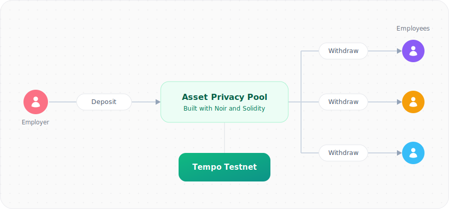

# Legato — Private Payroll PoC

A minimal private payroll proof of concept for employers to distribute salaries to employees through a shared asset privacy pool.

Built with [Noir](https://noir-lang.org) and deployed on Tempo's Moderato testnet.

<p align="center">
  
</p>

The project sets out to be a minimal proof of concept, intentionally leaving advanced features out of scope (e.g. multi-input note merging in a single proof, a withdrawal relayer for unlinking the payout address, fixed denominations to blunt amount-matching, time-based unlocks, etc.).

> **Note:** The project is not audited and is by no means production ready, do not deploy and use in production.

## Tech stack

| Category    | Tool                                    | Version used           | Used for                                 |
| ----------- | --------------------------------------- | ---------------------- | ---------------------------------------- |
| Frontend    | Next.js                                 | 16                     | App framework                            |
| Frontend    | Node.js                                 | 26 (`npm` 11)          | Runtime & package manager                |
| Frontend    | Noir `@noir-lang/noir_js`               | 1.0.0-beta.22          | In-browser witness generation            |
| Frontend    | Barretenberg (UltraHonk) `@aztec/bb.js` | 5.0.0-nightly.20260522 | In-browser proof generation              |
| Frontend    | circomlibjs                             | 0.1.7                  | Poseidon & BabyJubJub (matches Noir/Sol) |
| Frontend    | Wagmi                                   | 3                      | Wallet & contract interaction            |
| Frontend    | Tempo passkeys (WebAuthn)               | —                      | In-browser wallet: connect & sign        |
| Blockchain  | Foundry `forge`                         | 1.7.1                  | Compiling, testing & deploying contracts |
| Blockchain  | poseidon-solidity                       | —                      | On-chain Poseidon hashing                |
| Blockchain  | Tempo Moderato testnet                  | —                      | Deployment network                       |
| Development | Noir `nargo`                            | 1.0.0-beta.22          | Rebuilding circuits _(optional)_         |
| Development | Barretenberg `bb`                       | 5.0.0-nightly.20260522 | Regenerating verifiers _(optional)_      |

## Project layout

```
Legato/
├── circuits/
│   ├── deposit/             binds public value ↔ hidden-owner commitment
│   ├── withdraw/            Merkle membership + nullifier + partial-withdraw join-split
│   └── poseidon_check/      tri-language Poseidon regression vector
├── contracts/               Foundry project
│   ├── src/ShieldedPool.sol            commitment tree + nullifier set + key registry
│   ├── src/MerkleTreeWithHistory.sol   incremental Merkle tree (Poseidon)
│   ├── src/DepositVerifier.sol         (HonkVerifier, generated by bb)
│   ├── src/WithdrawVerifier.sol        (HonkVerifier, generated by bb)
│   ├── script/Deploy.s.sol
│   └── test/
└── frontend/                Next.js 16 + Wagmi v3 + Tempo Wallet
    ├── public/{deposit,withdraw}.json  compiled circuit artifacts
    └── src/
        ├── app/page.tsx        landing
        ├── app/create/page.tsx employer deposit flow
        ├── app/claim/page.tsx  employee register + withdraw flow
        └── lib/                crypto.ts, keys.ts, notes.ts, merkle.ts, noir.ts, pool.ts, contracts.ts
```

## Local development

### Run the app

Clone this repository:

```bash
git clone https://github.com/Savio-Sou/Legato.git
```

Run the app:

```bash
cd frontend
npm install
npm run dev
```

Open <https://localhost:3000> in your web browser to access the app.

### Rebuild the project

For if the circuits or contracts are changed and require redeployment.

#### 1. Compile circuits and generate Solidity verifiers

```bash
cd circuits/deposit  && nargo test && nargo compile
bb write_vk -t evm -b ./target/deposit.json -o ./target
bb write_solidity_verifier -t evm -k ./target/vk -o ../../contracts/src/DepositVerifier.sol
cp ./target/deposit.json ../../frontend/public/deposit.json

cd ../withdraw && nargo test && nargo compile
bb write_vk -t evm -b ./target/withdraw.json -o ./target
bb write_solidity_verifier -t evm -k ./target/vk -o ../../contracts/src/WithdrawVerifier.sol
cp ./target/withdraw.json ../../frontend/public/withdraw.json
```

Both verifiers are named `HonkVerifier`; the deploy script imports them under module aliases to avoid
the symbol clash.

#### 2. Deploy contracts

Build the smart contracts:

```bash
cd ../../contracts
forge install                # forge-std + poseidon-solidity
forge test
```

Create a _.env_ file:

```bash
cp .env.example .env
```

Generate or extract a deployer wallet's private key and copy it into the _.env_ file. Remember to fund it with testnet gas asset.

Deploy the smart contracts:

```bash
forge script script/Deploy.s.sol --rpc-url tempo --broadcast
```

#### 3. Update smart contract addresses

Edit the default addresses in [frontend/src/lib/contracts.ts](frontend/src/lib/contracts.ts).

### End-to-end test

A Playwright harness drives the real UI against the live testnet in three phases — employee registers,
employer deposits an encrypted note, employee scans and makes a partial withdrawal — asserting on-chain
results (key registered, pool funded by the salary, withdrawal pays out exactly the requested amount,
change note inserted):

```bash
cd frontend
npm run test:e2e        # = bash scripts/run-e2e.sh
```

It uses the dev connector (so it needs no passkey), reads the funder key from `contracts/.env`, and
funds a fresh employee with pathUSD for gas each run. Requires a Chromium that Playwright can launch.
